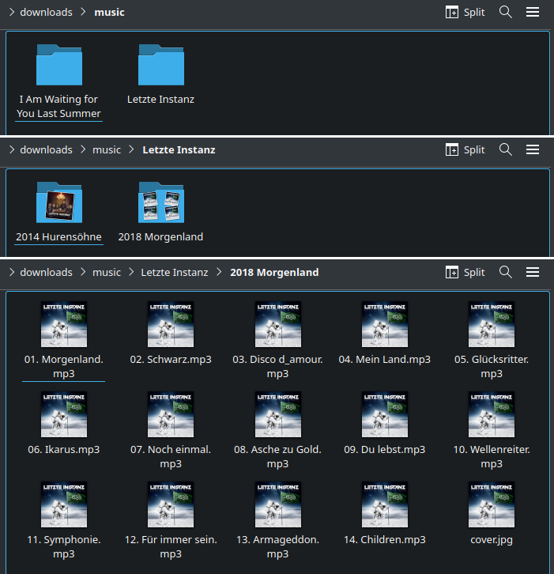

# YaMa Fisher

[Russian version](README_RU.md)

This project is a Firefox add-on for downloading music from Yandex Music.

⚠️⚠️⚠️
PIRACY IS BAD, AND THIS PROJECT CONDEMNS IT.
Any resemblance between the add-on's capabilities and downloading or
distributing content without the copyright holder's permission is purely
coincidental.
⚠️⚠️⚠️

- [about the project](#about-the-project)
- [installation](#installation)
- [questions](#questions)

## About the project

The extension helps download music from Yandex Music. It supports albums,
playlists, artists' top tracks, and individual tracks. It was built exclusively
for Firefox and has only been tested there, although it could potentially be
ported to other browsers.

It was originally based on
[Yandex Music Fisher Mod](https://github.com/vectorserver/yandex_music_fisher_mod/),
but has since been completely rewritten. It was written by neural networks
(vibe coding everywhere except this file), so explore the code at your own
risk.

Screenshots:

## Installation

- Download the latest project release from this
  [link](https://github.com/tetelevm/yama_fisher/releases/download/v1.5.1/yama_fisher_1_5_1.zip).
- Open `about:debugging#/runtime/this-firefox` in a new Firefox tab.
- Under `Load Temporary Add-on…`, select the downloaded archive.
- Open an album page on Yandex Music and click the extension icon. It may be
  hidden under Firefox's general extensions icon.

Alternatively, download the entire project and point Firefox directly to
`manifest.json`. If you choose this option, you probably already know what to
do.

## Questions

For questions or suggestions, open an
[issue](https://github.com/tetelevm/yama_fisher/issues).
